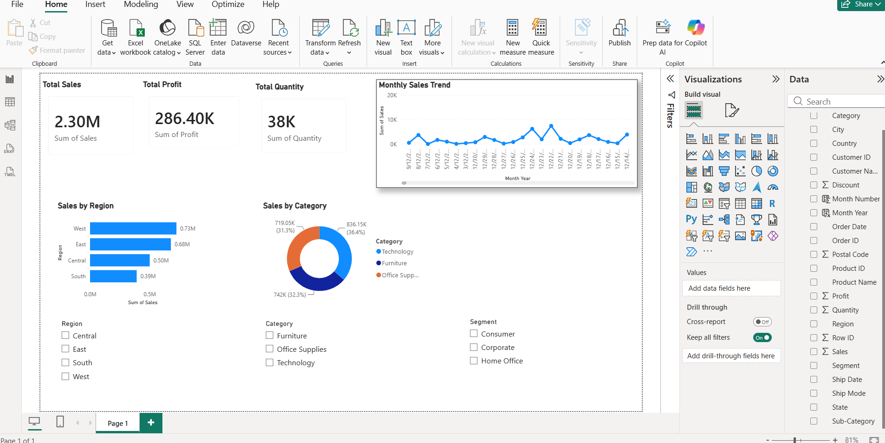

# 📊 Sales EDA & Power BI Dashboard

> End-to-end sales analysis — Python EDA uncovering business insights, visualized in an interactive Power BI dashboard.


## 📌 Project Overview

This project performs a full sales analysis on the **Superstore dataset** (9,994 orders across the USA) using Python for EDA and Power BI for interactive dashboarding.

**Business questions answered:**
- Which regions, categories, and segments drive the most profit?
- What time of year sees the highest sales?
- Which products are being sold at a loss despite high order volume?
- Which customer segments should the business prioritise?

**Dataset:** [Superstore Sales — Kaggle](https://www.kaggle.com/datasets/vivek468/superstore-dataset-final)
9,994 orders · 21 columns · Years 2014–2017

---

## 📸 Dashboard Preview

> Built in Power BI Desktop — 3 pages: Overview, Product Analysis, Customer Segments




> 💡 **[View live dashboard →](https://app.powerbi.com/YOUR-LINK-HERE)**
> *(Publish your dashboard to Power BI Service and paste the share link here)*

---

## 🗂️ Project Structure

```
EDA-PowerBI-Sales
│
├── data
│   ├── superstore.csv
│   └── superstore_cleaned.csv
│
├── outputs
│   ├── dashboard_overview.png
│   ├── dashboard_products.png
│   ├── dashboard_customers.png
│   └── figures
│       ├── correlation_heatmap.png
│       ├── discount_vs_profit.png
│       ├── monthly_sales_trend.png
│       ├── sales_profit_by_region.png
│       ├── shipping_days.png
│       └── subcategory_profit.png
│
├── powerbi
│   └── Sales_Dashboard.pbix
│
├── scripts
│   ├── preprocessing.py
│   └── eda.py
│
├── requirements.txt
└── README.md

---

```
🧹 Data Preprocessing


```python
import pandas as pd
import numpy as np

df = pd.read_csv('data/superstore.csv', encoding='latin-1')

print(df.shape         # (9994, 21)
print(df.dtypes)
print(df.isnull().sum() # check nulls

# Fix date columns
df['Order Date'] = pd.to_datetime(df['Order Date'])

df['Ship Date'] = pd.to_datetime(df['Ship Date'])

# Extract time features
df['Order Year']  = df['Order Date'].dt.year
df['Order Month'] = df['Order Date'].dt.month
df['Order Month Name'] = df['Order Date'].dt.strftime('%b')
df['Ship Days']   = (df['Ship Date'] - df['Order Date']).dt.days

# Flag loss-making orders
df['Is Loss'] = df['Profit'] < 0

# Save cleaned file
df.to_csv('data/superstore_cleaned.csv', index=False)
print("Cleaned dataset saved.")

No missing values found. Key engineered features: Order Year, Order Month, Ship Days, Is Loss.

**No missing values found.** Key engineered features: `Order Year`, `Order Month`, `Ship Days`, `Is Loss`.

---
```
## 📊 Exploratory Data Analysis

### 1. Sales & profit by region

```python
import pandas as pd
import matplotlib.pyplot as plt
import seaborn as sns
df = pd.read_csv("data/superstore_cleaned.csv")

print(df.head())

region_summary = df.groupby('Region').agg(
    Total_Sales=('Sales','sum'),
    Total_Profit=('Profit','sum'),
    Order_Count=('Order ID','nunique')
).reset_index()

fig, axes = plt.subplots(1,2,figsize=(12,5))

axes[0].bar(region_summary['Region'],region_summary['Total_Sales'])
axes[0].set_title("Sales by Region")

axes[1].bar(region_summary['Region'],region_summary['Total_Profit'])
axes[1].set_title("Profit by Region")

plt.tight_layout()

plt.savefig("outputs/figures/sales_profit_by_region.png")

plt.show()

```

### 2. Monthly sales trend (seasonality)

```python
monthly = df.groupby(['Order Year', 'Order Month'])['Sales'].sum().reset_index()

plt.figure(figsize=(12,5))

for year in monthly['Order Year'].unique():
    subset = monthly[monthly['Order Year'] == year]
    plt.plot(subset['Order Month'],
             subset['Sales'],
             marker='o',
             linewidth=2,
             label=str(year))

plt.title("Monthly Sales Trend")
plt.xlabel("Month")
plt.ylabel("Sales")

plt.xticks(range(1,13),
['Jan','Feb','Mar','Apr','May','Jun',
 'Jul','Aug','Sep','Oct','Nov','Dec'])

plt.legend(title="Year")

plt.tight_layout()

plt.savefig("outputs/figures/monthly_sales_trend.png")

plt.show()

```

### 3. Category & sub-category breakdown

```python
subcat = df.groupby('Sub-Category').agg(
    Sales=('Sales','sum'),
    Profit=('Profit','sum')
).reset_index()

subcat = subcat.sort_values('Profit')

colors = ['red' if x < 0 else 'steelblue' for x in subcat['Profit']]

plt.figure(figsize=(12,7))

plt.barh(subcat['Sub-Category'],
         subcat['Profit'],
         color=colors)

plt.axvline(0,color='black')

plt.title("Profit by Sub-Category")

plt.tight_layout()

plt.savefig("outputs/figures/subcategory_profit.png")

plt.show()

```

### 4. Discount vs profit correlation

```python
plt.figure(figsize=(8,5))

plt.scatter(df['Discount'],
            df['Profit'],
            alpha=0.4)

plt.axhline(0,color='red')

plt.title("Discount vs Profit")

plt.xlabel("Discount")

plt.ylabel("Profit")

plt.tight_layout()

plt.savefig("outputs/figures/discount_vs_profit.png")

plt.show()
```

### 5. Shipping speed analysis

```python
ship = df.groupby('Ship Mode')['Ship Days'].mean()

plt.figure(figsize=(8,5))

plt.bar(ship.index,
        ship.values)

plt.title("Average Shipping Days")

plt.ylabel("Days")

plt.xticks(rotation=15)

plt.tight_layout()

plt.savefig("outputs/figures/shipping_days.png")

plt.show()
```

### 6. Correlation heatmap

```python
corr = df[['Sales',
           'Profit',
           'Quantity',
           'Discount',
           'Ship Days']].corr()

plt.figure(figsize=(8,6))

sns.heatmap(corr,
            annot=True,
            cmap='Blues')

plt.title("Correlation Heatmap")

plt.tight_layout()

plt.savefig("outputs/figures/correlation_heatmap.png")

plt.show()
```

---

## 📈 Key EDA Findings

| Finding | Detail |
|---|---|
| **West region leads in sales** | $725K total sales but only 12.4% profit margin |
| **Q4 is peak season** | Nov–Dec consistently account for 30%+ of annual sales |
| **Tables & Bookcases lose money** | Highest discount rates (30–50%) wipe out all profit |
| **Discount kills profit** | Correlation = −0.22; orders with >20% discount almost always lose money |
| **Technology has the best margins** | 17.4% profit margin vs Furniture at just 2.5% |
| **Standard Class is 78% of orders** | Despite being slowest — customers prioritise cost over speed |

---

## 🖥️ Power BI Dashboard

### How to build it (step by step)

**Step 1 — Load data**
- Open Power BI Desktop → Home → Get Data → Text/CSV
- Load `superstore_cleaned.csv`

**Step 2 — Power Query transformations**
- Verify `Order Date` and `Ship Date` are Date type (not text)
- Add custom column: `Ship Days = [Ship Date] - [Order Date]`
- Add custom column: `Profit Flag = if [Profit] < 0 then "Loss" else "Profit"`

**Step 3 — DAX measures to create**

```dax
Total Sales    = SUM('superstore'[Sales])
Total Profit   = SUM('superstore'[Profit])
Profit Margin  = DIVIDE([Total Profit], [Total Sales], 0)
Total Orders   = DISTINCTCOUNT('superstore'[Order ID])
Avg Order Value = DIVIDE([Total Sales], [Total Orders], 0)

YoY Sales Growth =
VAR CurrentYear = CALCULATE([Total Sales], YEAR('superstore'[Order Date]) = MAX(YEAR('superstore'[Order Date])))
VAR PrevYear    = CALCULATE([Total Sales], YEAR('superstore'[Order Date]) = MAX(YEAR('superstore'[Order Date])) - 1)
RETURN DIVIDE(CurrentYear - PrevYear, PrevYear, 0)
```

**Step 4 — Build 3 dashboard pages**

*Page 1 — Overview*
- 4 KPI cards: Total Sales · Total Profit · Profit Margin % · Total Orders
- Line chart: Monthly sales trend (with year slicer)
- Bar chart: Sales & Profit by Region
- Donut chart: Sales by Category
- Slicer: Year, Region, Segment

*Page 2 — Product Analysis*
- Bar chart: Profit by Sub-Category (conditional formatting — red for losses)
- Scatter chart: Discount vs Profit (shows the discount-kills-profit pattern)
- Table: Top 10 loss-making products
- Treemap: Sales by Category → Sub-Category

*Page 3 — Customer Segments*
- Bar chart: Sales by Customer Segment
- Matrix: Segment × Region → Profit
- Line chart: Monthly orders by Segment
- KPI cards filtered by segment slicer

**Step 5 — Publish**
- File → Publish → My Workspace
- Copy the share link and paste into the README above

---

## 💡 Business Recommendations

| Recommendation | Data Evidence | Action |
|---|---|---|
| **Stop discounting Furniture > 20%** | Every order with >20% discount in Furniture shows negative profit | Set a discount cap of 15% in CRM |
| **Push Technology in Q1–Q2** | Technology margin is 17.4% but sales dip in Jan–Mar | Run targeted campaigns in slow months |
| **Investigate West region efficiency** | Highest sales but margin lags behind East by 4% | Audit shipping and return costs |
| **Upsell Standard Class customers** | 78% choose Standard — a small % shift to First Class improves margins | Show "fast shipping" options at checkout |

---

## 🚀 How to Run

```bash
git clone https://github.com/Rohittt619/EDA-PowerBI-Sales
cd EDA-PowerBI-Sales
pip install -r requirements.txt
jupyter notebook notebooks/sales_EDA.ipynb
```

Open `powerbi/Sales_Dashboard.pbix` in **Power BI Desktop** (free download from Microsoft).

---

## 📦 Requirements

```
pandas==2.0.3
numpy==1.24.3
matplotlib==3.7.2
seaborn==0.12.2
jupyter==1.0.0
openpyxl==3.1.2
```

---

## 👨‍💻 Author

**Rohit Rathod** — Junior Data Analyst  
📧 rrathod1101@gmail.com · [LinkedIn](https://linkedin.com/in/rohit-rathod-19442a228· [GitHub](https://github.com/Rohittt619)

---

*If this project helped you, give it a ⭐!*
